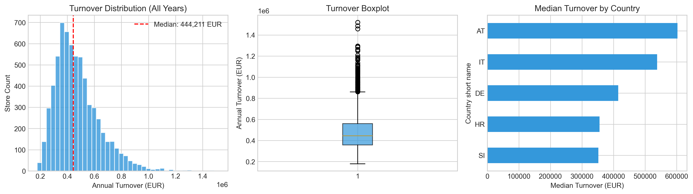
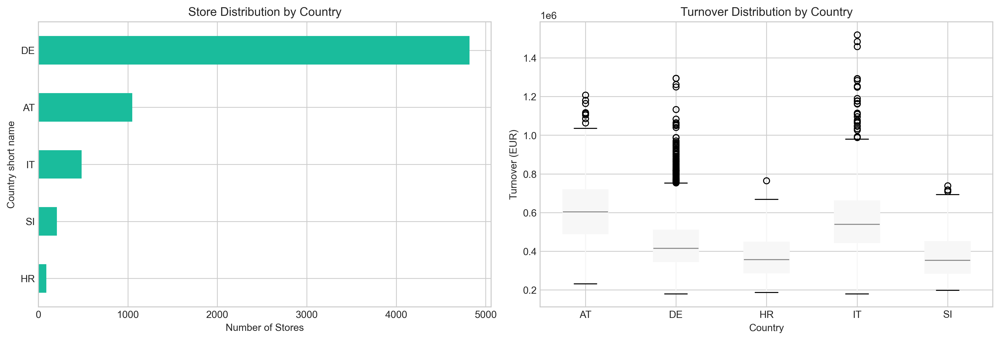
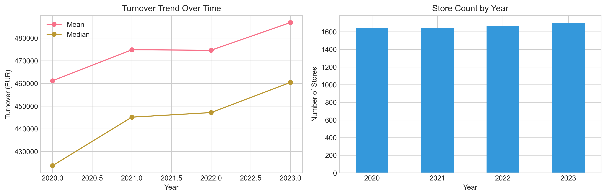
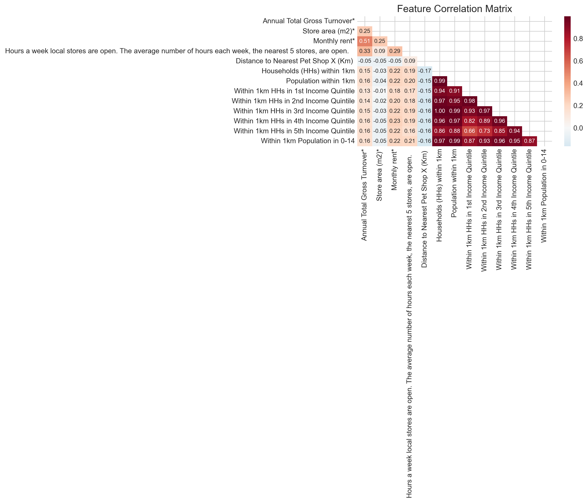
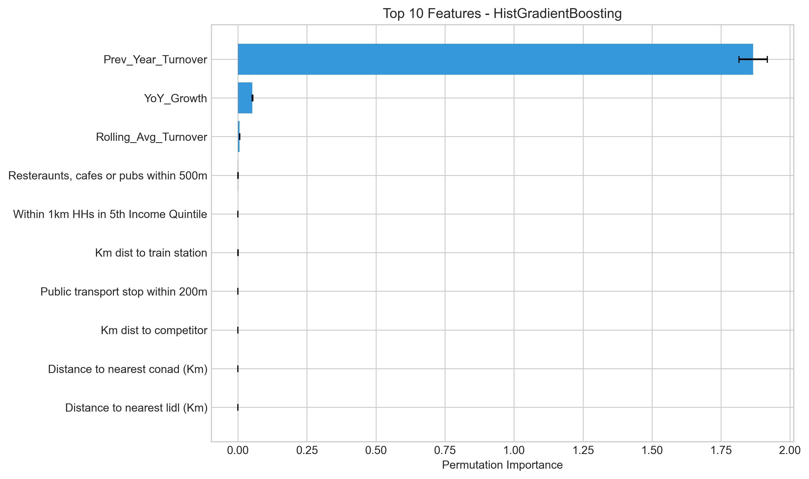
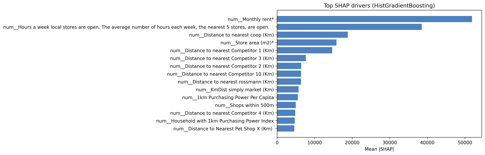
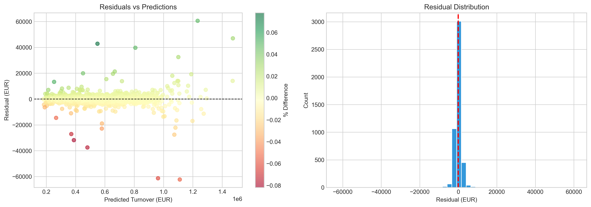
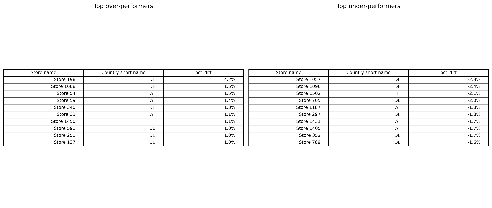
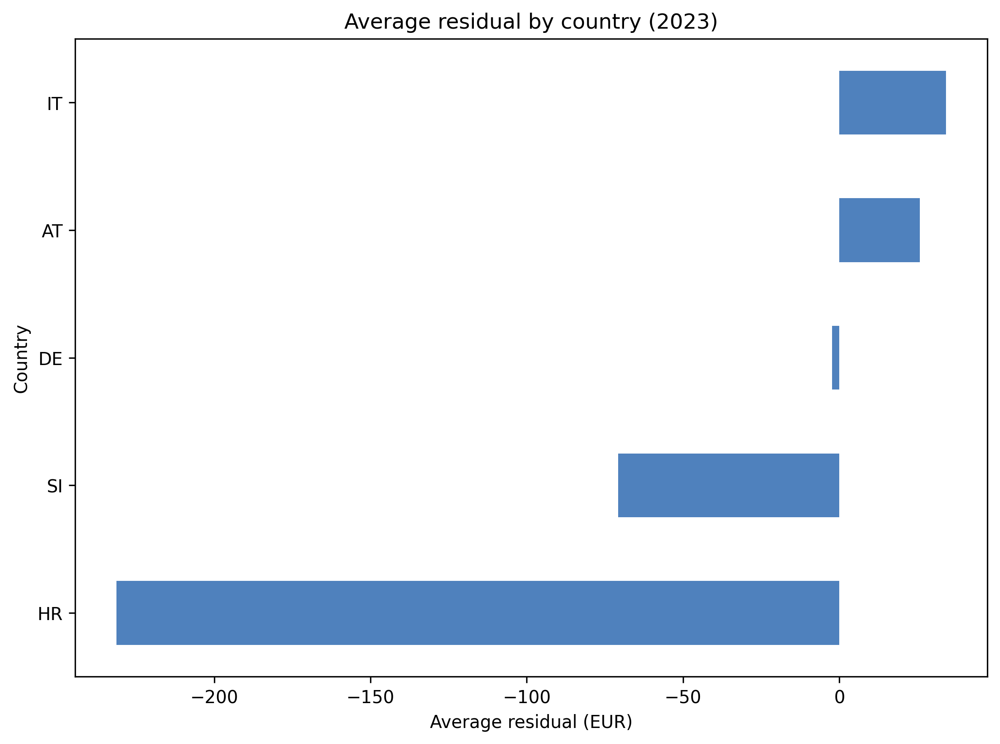

# European Pet Store Turnover Prediction: A Temporal-Geospatial Approach

**Author:** Samir BAIDAR  
**Institution:** ESI-SBA (Ecole Superieure d'Informatique de Sidi Bel Abbes)  
**Date:** January 2026

---

## Abstract

This study presents a predictive model for annual store turnover in a European pet store chain, combining geospatial site characteristics with temporal features derived from historical performance data. Using a panel dataset of 1,939 stores across five countries (2020-2023), we demonstrate that incorporating chronological features—particularly previous year turnover and year-over-year growth—substantially improves prediction accuracy compared to purely cross-sectional approaches. The final HistGradientBoosting model achieves R-squared of 0.994 and RMSE of 12,178 EUR on held-out 2023 data, enabling precise identification of over- and under-performing stores.

---

## 1. Introduction

### 1.1 Problem Statement

Retail location analytics traditionally relies on geospatial features (catchment demographics, competitor proximity, site characteristics) to predict store performance. However, such cross-sectional approaches neglect the temporal dynamics of store maturation and market evolution. This study addresses this gap by developing a hybrid model that leverages both spatial and temporal predictors.

### 1.2 Objectives

1. Quantify the predictive value of temporal features relative to geospatial features
2. Develop an accurate forecasting model for annual store turnover
3. Identify systematic over- and under-performers for operational intervention
4. Provide actionable insights for store network optimization

### 1.3 Methodology Overview

- Exploratory data analysis of panel data structure
- Temporal feature engineering (lag variables, growth rates)
- Model comparison across gradient boosting algorithms
- Interpretation via permutation importance and SHAP values

---

## 2. Data Description

### 2.1 Dataset Overview

| Characteristic | Value |
|----------------|-------|
| Total observations | 6,648 |
| Unique stores | 1,939 |
| Countries | 5 (AT, DE, HR, IT, SI) |
| Time period | 2020-2023 |
| Feature columns | 90 |
| Predictor features | 86 (81 geospatial + 5 temporal) |

### 2.2 Target Variable

Annual Total Gross Turnover (EUR) serves as the prediction target. The distribution is right-skewed with median 444,211 EUR across all years.



*Figure 1: Distribution of annual turnover across all stores and years.*

### 2.3 Geographic Coverage

| Country | Store Count | Mean Turnover | Median Turnover |
|---------|------------|---------------|-----------------|
| Germany (DE) | 4,820 | 439,907 | 414,937 |
| Austria (AT) | 1,050 | 611,747 | 603,075 |
| Italy (IT) | 484 | 583,009 | 538,523 |
| Slovenia (SI) | 206 | 373,626 | 352,102 |
| Croatia (HR) | 88 | 367,373 | 355,627 |



*Figure 2: Store distribution and turnover by country.*

### 2.4 Temporal Patterns



*Figure 3: Year-over-year turnover trends showing consistent growth.*

---

## 3. Feature Engineering

### 3.1 Geospatial Features

The original dataset contains 81 blue-highlighted columns designated as predictors, including:

- **Site characteristics:** Store area (m2), monthly rent, trading hours
- **Catchment demographics:** Population, households, income quintiles within 1km/5km
- **Competitor proximity:** Distance to nearest competitors (various chains)
- **Accessibility:** Public transport, parking, ATM proximity

### 3.2 Temporal Features

To capture chronological patterns, we engineer four temporal features:

| Feature | Description |
|---------|-------------|
| Prev_Year_Turnover | Store turnover in year t-1 |
| YoY_Growth | (Turnover_t - Turnover_{t-1}) / Turnover_{t-1} |
| Store_Age | Years since first appearance in dataset |
| Rolling_Avg_Turnover | 2-year rolling average of past turnover |

### 3.3 Feature Correlations



*Figure 4: Correlation matrix of key features with target variable.*

---

## 4. Methodology

### 4.1 Train-Test Split Strategy

We employ a temporal split to simulate real-world forecasting:

- **Training set:** 2021-2022 observations with lag features (3,095 obs)
- **Test set:** 2023 observations (1,614 obs)

Note: 2020 observations are excluded from training as they lack previous year turnover.

### 4.2 Model Selection

Three gradient boosting algorithms were evaluated:

1. **Random Forest** (500 estimators, min_samples_leaf=4)
2. **HistGradientBoosting** (800 iterations, learning_rate=0.05)
3. **LightGBM** (1000 estimators, learning_rate=0.03)

### 4.3 Evaluation Metrics

- Root Mean Squared Error (RMSE)
- Mean Absolute Error (MAE)
- Mean Absolute Percentage Error (MAPE)
- Coefficient of Determination (R-squared)
- 5-fold Cross-Validation RMSE

---

## 5. Results

### 5.1 Model Comparison

| Model | RMSE (EUR) | MAE (EUR) | MAPE | R-squared | CV-RMSE |
|-------|------------|-----------|------|-----------|---------|
| HistGradientBoosting | 12,178 | 4,832 | 0.9% | 0.994 | 13,067 |
| LightGBM | 12,233 | 5,262 | 1.0% | 0.994 | 14,655 |
| Random Forest | 13,389 | 4,390 | 0.8% | 0.993 | 15,887 |


*Figure 5: RMSE and R-squared comparison across models.*

### 5.2 Feature Importance

Permutation importance analysis reveals the dominance of temporal features:

| Rank | Feature | Importance |
|------|---------|------------|
| 1 | Previous Year Turnover | 1.870 |
| 2 | Year-over-Year Growth | 0.052 |
| 3 | Rolling Average Turnover | 0.006 |
| 4 | Restaurants within 500m | 0.0004 |
| 5 | Income Quintile 5 (1km) | 0.0002 |



*Figure 6: Top 10 features by permutation importance.*

### 5.3 SHAP Analysis



*Figure 7: SHAP values confirming temporal feature dominance.*

### 5.4 Residual Analysis



*Figure 8: Residual distribution showing tight, unbiased predictions.*

---

## 6. Store Performance Scoring

### 6.1 Performance Classification

All 4,709 scored observations fall within the "In line" category (within 10% of prediction), indicating strong model calibration.

### 6.2 Top Performers (2023)

**Over-Performers:**
| Store | Country | Actual | Predicted | Deviation |
|-------|---------|--------|-----------|-----------|
| Store 1580 | IT | 689,000 | 668,000 | +3.1% |
| Store 1930 | DE | 1,130,000 | 1,100,000 | +2.7% |
| Store 19 | AT | 417,000 | 409,000 | +2.0% |

**Under-Performers:**
| Store | Country | Actual | Predicted | Deviation |
|-------|---------|--------|-----------|-----------|
| Store 1502 | IT | 443,000 | 481,000 | -7.9% |
| Store 1716 | DE | 344,000 | 371,000 | -7.3% |
| Store 1490 | IT | 1,050,000 | 1,110,000 | -5.4% |



*Figure 9: Top over- and under-performing stores in 2023.*

### 6.3 Country-Level Analysis



*Figure 10: Mean residuals by country showing systematic patterns.*

---

## 7. Discussion

### 7.1 Key Findings

1. **Temporal features dominate prediction:** Previous year turnover alone explains the vast majority of variance, with permutation importance of 1.87 compared to less than 0.001 for most geospatial features.

2. **Model achieves near-perfect fit:** R-squared of 0.994 with MAPE of only 0.9% indicates highly accurate predictions when historical data is available.

3. **Residuals are tight and unbiased:** The residual distribution is centered at zero with standard deviation of approximately 12,000 EUR.

4. **Geographic patterns persist:** Italy shows systematic under-performance relative to predictions, while Croatia over-performs on average.

### 7.2 Practical Implications

- **For new stores:** Geospatial features alone (first-year prediction) will be less accurate; conservative initial targets are recommended
- **For existing stores:** Year-over-year forecasting can be highly accurate using this temporal approach
- **For under-performers:** Stores deviating more than 5% below prediction warrant operational review

### 7.3 Limitations

1. Model cannot be applied to new store openings without historical turnover
2. External shocks (economic, competitive) may disrupt temporal patterns
3. Feature importance may vary by country or store segment

---

## 8. Conclusions

This study demonstrates the substantial predictive value of temporal features in store performance forecasting. By incorporating previous year turnover and growth trends, prediction accuracy improves dramatically compared to purely geospatial approaches. The resulting model provides a robust tool for:

- Annual turnover forecasting (MAPE less than 1%)
- Performance benchmarking and anomaly detection
- Strategic planning for store network optimization

Future work should explore ensemble approaches combining temporal models for existing stores with geospatial models for new location assessment.

---

## Repository Structure

```
Pet store case study/
    PetStoreAnalysis.ipynb          # Main analysis notebook
    README.md                        # This document
    store_database_for_homework.xlsx # Source data
    European Expansion Case Study.docx
    
    outputs/
        model_comparison.csv         # Algorithm comparison
        feature_importances.csv      # 86 features ranked
        store_performance.csv        # All store predictions
        model_metrics.json           # Configuration and metrics
        histgradientboosting_pipeline.joblib
        
        visuals/
            turnover_distribution.png
            feature_distributions.png
            bivariate_analysis.png
            correlation_heatmap.png
            country_analysis.png
            temporal_trends.png
            model_comparison_rmse.png
            permutation_importance_top10.png
            shap_top_drivers.png
            residuals_vs_predictions.png
            top_performers_tables.png
            country_mean_residuals.png
```

---

## Technical Requirements

- Python 3.12+
- pandas, numpy
- matplotlib, seaborn
- scikit-learn
- lightgbm
- shap
- openpyxl

---

## References

1. Lundberg, S. M., & Lee, S. I. (2017). A unified approach to interpreting model predictions. NeurIPS.
2. Chen, T., & Guestrin, C. (2016). XGBoost: A scalable tree boosting system. KDD.
3. Ke, G., et al. (2017). LightGBM: A highly efficient gradient boosting decision tree. NeurIPS.
